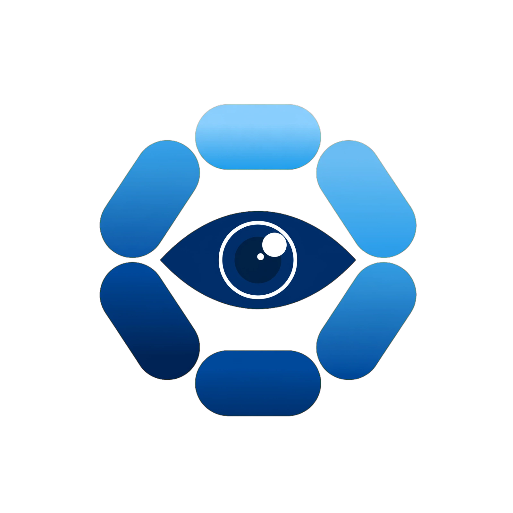
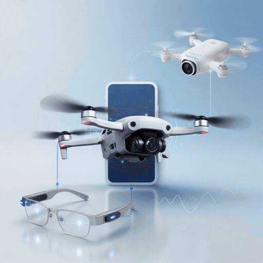
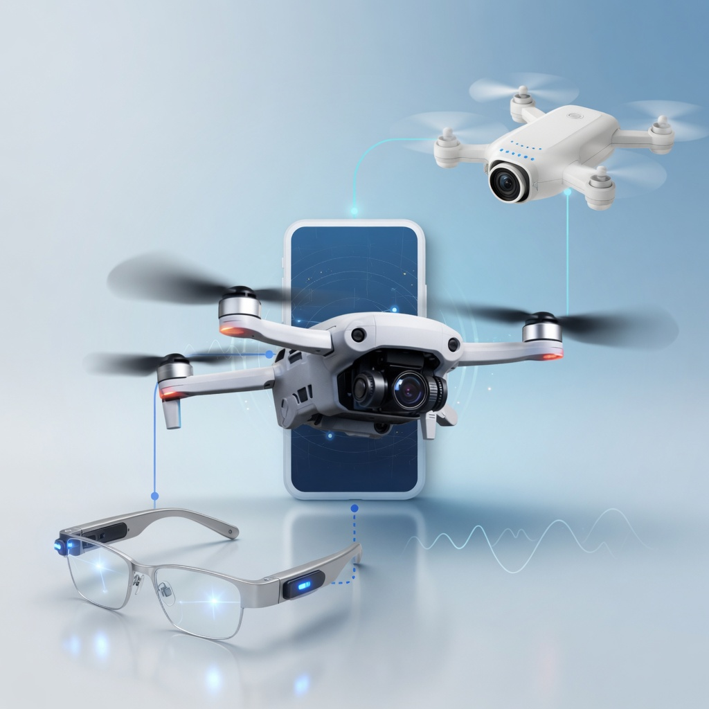
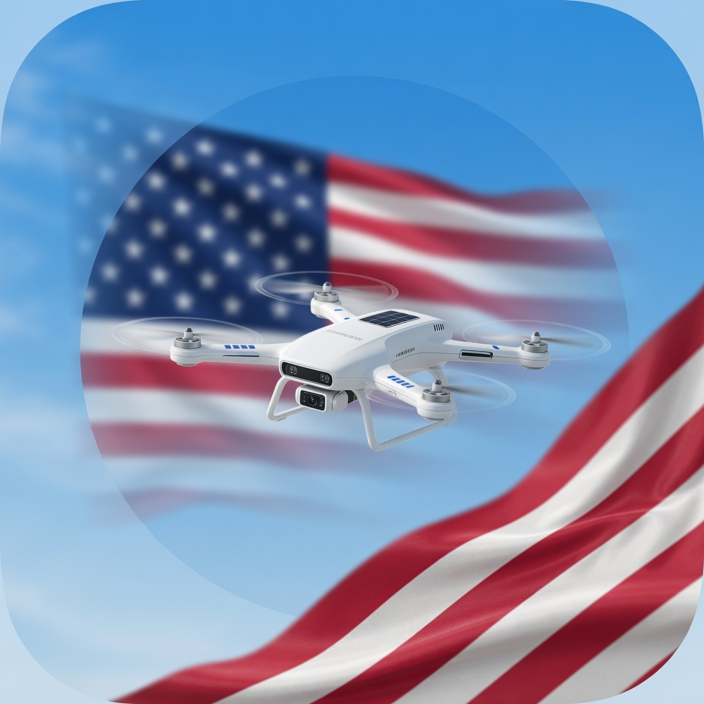
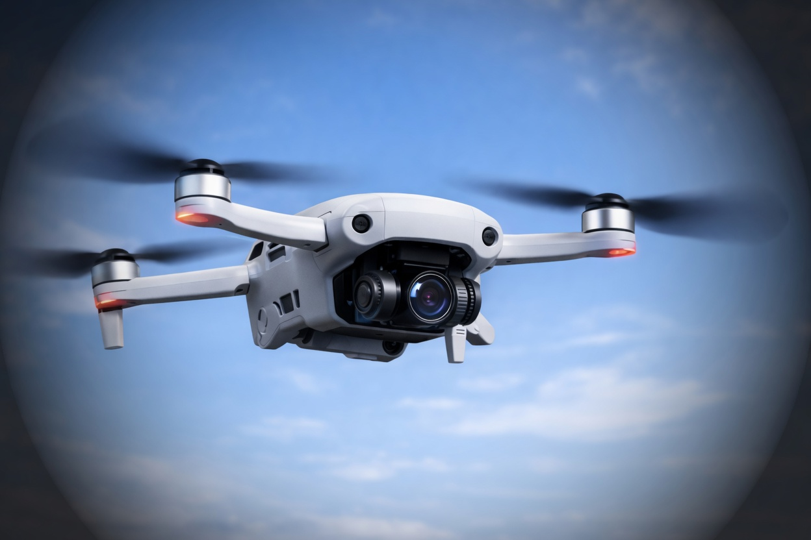

# eyeWalker v1.1 👓🦮

[](LICENSE)
[](DUAL_LICENSE.md)
[](https://github.com/aeyemovment/eyeWalker-v1.1)
[](SAFETY.md)
[](#about-neuroagent-ai)
[](docs/pwa.html)

**Simulated accessibility-interface research prototype** for people with visual impairment — including **rare neurologic diseases affecting vision** and other neurologic / ophthalmologic causes of vision loss. The current build is not a navigation or mobility aid.

> **This is assistive, not a replacement for cane or guide dog. Always keep your traditional mobility aid.**  
> **Not a medical device.** Research prototype only. No FDA clearance. Not intended to diagnose, treat, or cure.

---

## Public source and project links

| | |
|--|--|
| **Code (this repo)** | https://github.com/aeyemovment/eyeWalker-v1.1 |
| **Clone** | `git clone https://github.com/aeyemovment/eyeWalker-v1.1.git` |
| **Canonical PWA source** | [docs/pwa.html](docs/pwa.html) |
| **Pages route (verify deployed revision)** | https://aeyemovment.github.io/eyeWalker-v1.1/pwa.html |
| **Releases** | https://github.com/aeyemovment/eyeWalker-v1.1/releases |
| **OGX provider** | https://github.com/aeyemovment/ogx-provider-eyewalker |
| **HF Space route (verify deployed revision)** | https://huggingface.co/spaces/NeuroAgentAI/eyeWalker |
| **Open status** | [OPEN_SOURCE.md](OPEN_SOURCE.md) · [DUAL_LICENSE.md](DUAL_LICENSE.md) |

---

## About NeuroAgent AI

**eyeWalker** is built by **NeuroAgent AI** for:

- Rare neuro-ophthalmic and neurologic conditions affecting vision (e.g. NMOSD, MOGAD, LHON, OPA1, IIH, CVI, and related phenotypes)
- Broader **low vision / visual impairment** interface and accessibility research
- Local-first demos developers and users can improve together



---

## Inspiration

eyeWalker comes from a simple mandate: **help people with vision loss explore accessibility interfaces** without pretending software can replace a cane, guide dog, or clinician.

The long-range research story is **multimodal** — phone, glasses-class wearables, and (where lawful and consented) elevated *concept* views as future interface experiments. The **open v1.1 build is narrower**: a **simulated** browser PWA research demo, not a live aerial or surveillance product.



| Multimodal concept (drone · phone · glasses) | Flag + drone motif | Clean drone avatar |
|:--:|:--:|:--:|
|  |  |  |

**Concept art only** — not a medical device UI, not an operational dual-use system, not a privacy or national-security product claim. Full write-up: **[docs/INSPIRATION.md](docs/INSPIRATION.md)**.

---

## What’s in v1.1 (2026-07-26)

See [docs/CHANGELOG_v1.1.md](docs/CHANGELOG_v1.1.md).

- **PWA simulated-session mode** with preview/record-only camera access; **simulated research cues** labeled by default (not silent “live AI”)
- **REC** only with **explicit consent** (no auto-record); pause/resume; Save exports local package
- **Left/right guidance** steps *away* from obstacle bearing (regression-tested)
- Optional **NemoClaw** unloaded/unenforced policy sketch + **Omniverse** unavailable synthetic-sim stub (not required for PWA)
- Synthetic DT labels under `docs/training/synthetic/` (rebuild script; repo-relative paths)
- Path-scoped license: PolyForm NC by default; only exact files enumerated in `DUAL_LICENSE.md` use MIT
- CI: unit tests + synthetic rebuild check

---

## Quickstart

```bash
git clone https://github.com/aeyemovment/eyeWalker-v1.1.git
cd eyeWalker-v1.1
pip install -e .

# Local PWA
python3 -m http.server -d docs 8080
# open http://127.0.0.1:8080/pwa.html
```

The expected Pages route is https://aeyemovment.github.io/eyeWalker-v1.1/pwa.html.
Verify its deployed revision before treating it as this release.

Optional demo scripts (research / mock):

```bash
python examples/harbor_walk.py   # if present — sample path mock, not clinical
```

---

## Architecture (simulated accessibility-interface research)

```
PWA camera → preview / consented recording only

deterministic synthetic generator → mock obstacle records → simulated HUD/text cues

These paths are adjacent interface experiments in this build: camera pixels
are not inspected to produce the synthetic cues.
```

Optional research interfaces under `eyewalker/` are stubs, deterministic
fixtures, caller-supplied adapters, or explicitly consented remote experiments.
They are not an end-to-end perception system or clinical decision support.
Details: [docs/ARCHITECTURE.md](docs/ARCHITECTURE.md).

---

## Safety

Full policy: [SAFETY.md](SAFETY.md) · [docs/SAFETY.md](docs/SAFETY.md)

- Keep **cane / guide dog / trusted human** always
- Do not act on current cue text; use it only for stationary or controlled interface evaluation
- Report simulated-interface defects: [CONTRIBUTING.md](CONTRIBUTING.md)

---

## License

- **Core** — [PolyForm Noncommercial 1.0.0](LICENSE)
- **Only exact mobile/PWA files enumerated in `DUAL_LICENSE.md`** — [MIT](LICENSE-MIT)

Commercial use of the core: open an issue with tag `commercial-license`. See [DUAL_LICENSE.md](DUAL_LICENSE.md).

---

## Privacy

Local-first demos preferred. Do not upload bystander-identifying video without consent. [PRIVACY.md](PRIVACY.md).

---

© 2026 NeuroAgent AI · eyeWalker **v1.1.9** · Research prototype — not a medical device.
