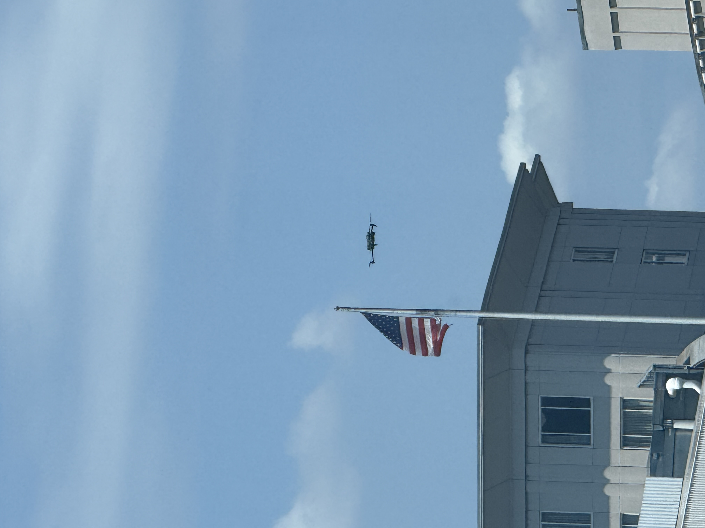

# eyeWalker v1.1 👓🦮



[](LICENSE)
[](LICENSE-MIT)
[](https://github.com/aeyemovment/eyeWalker-v1.1)
[](SAFETY.md)
[](#about-neuroagent-ai)
[](https://aeyemovment.github.io/eyeWalker-v1.1/pwa.html)

**Assistive navigation research prototype** for people with visual impairment — including **rare neurologic diseases affecting vision** and other neurologic / ophthalmologic causes of vision loss.

> **This is assistive, not a replacement for cane or guide dog. Always keep your traditional mobility aid.**  
> **Not a medical device.** Research prototype only. No FDA clearance. Not intended to diagnose, treat, or cure.

---

## Links (open source)

| | |
|--|--|
| **Code (this repo)** | https://github.com/aeyemovment/eyeWalker-v1.1 |
| **Clone** | `git clone https://github.com/aeyemovment/eyeWalker-v1.1.git` |
| **Live PWA** | https://aeyemovment.github.io/eyeWalker-v1.1/pwa.html |
| **Releases** | https://github.com/aeyemovment/eyeWalker-v1.1/releases |
| **OGX provider** | https://github.com/aeyemovment/ogx-provider-eyewalker |
| **HF Space** | https://huggingface.co/spaces/NeuroAgentAI/eyeWalker |
| **Open status** | [OPEN_SOURCE.md](OPEN_SOURCE.md) · [DUAL_LICENSE.md](DUAL_LICENSE.md) |

---

## About NeuroAgent AI

**eyeWalker** is built by **NeuroAgent AI** for:

- Rare neuro-ophthalmic and neurologic conditions affecting vision (e.g. NMOSD, MOGAD, LHON, OPA1, IIH, CVI, and related phenotypes)  
- Broader **low vision / visual impairment** assistive navigation research  
- Local-first demos developers and users can improve together  


---

## What’s in v1.1 (2026-07-26)

See [docs/CHANGELOG_v1.1.md](docs/CHANGELOG_v1.1.md).

- **PWA walk mode** with camera; **simulated research cues** labeled by default (not silent “live AI”)  
- **REC** only with **explicit consent** (no auto-record); pause/resume; Save exports local package  
- **Left/right guidance** steps *away* from obstacle bearing (regression-tested)  
- Optional **NemoClaw** local-first harness docs + **Omniverse** synthetic-sim stub (not required for PWA)  
- Synthetic DT labels under `docs/training/synthetic/` (rebuild script; repo-relative paths)  
- Dual license: PolyForm NC core + MIT mobile/PWA  
- CI: unit tests + synthetic rebuild check

---

## Quickstart

```bash
git clone https://github.com/aeyemovment/eyeWalker-v1.1.git
cd eyeWalker-v1.1
pip install -e .

# Local PWA
python3 -m http.server -d docs 8080
# open http://127.0.0.1:8080/pwa.html
```

Or use the live PWA: https://aeyemovment.github.io/eyeWalker-v1.1/pwa.html

Optional demo scripts (research / mock):

```bash
python examples/harbor_walk.py   # if present — sample path mock, not clinical
```

---

## Architecture (medical assistive — high level)

```
Phone / HMD camera  →  perception (mock or VLM)  →  obstacle / ground cues
        ↑                        ↓
   user GPS / map          accessibility output
   (optional)              (speech / HUD — advisory only)
```

Optional research modules under `eyewalker/` (efference-guided inference experiments, local salience overlays) are **synthetic / research** — not clinical decision support. Details: [docs/ARCHITECTURE.md](docs/ARCHITECTURE.md).

---

## Safety

Full policy: [SAFETY.md](SAFETY.md) · [docs/SAFETY.md](docs/SAFETY.md)

- Keep **cane / guide dog / trusted human** always  
- Guidance is **advisory** — never guaranteed free path  
- Report missed obstacles: [CONTRIBUTING.md](CONTRIBUTING.md)  

---

## License

- **Core** — [PolyForm Noncommercial 1.0.0](LICENSE)  
- **Mobile / PWA** — [MIT](LICENSE-MIT)  

Commercial use of the core: open an issue with tag `commercial-license`. See [DUAL_LICENSE.md](DUAL_LICENSE.md).

---

## Privacy

Local-first demos preferred. Do not upload bystander-identifying video without consent. [PRIVACY.md](PRIVACY.md).

---

© 2026 NeuroAgent AI · eyeWalker **v1.1.2** · Research prototype — not a medical device.
