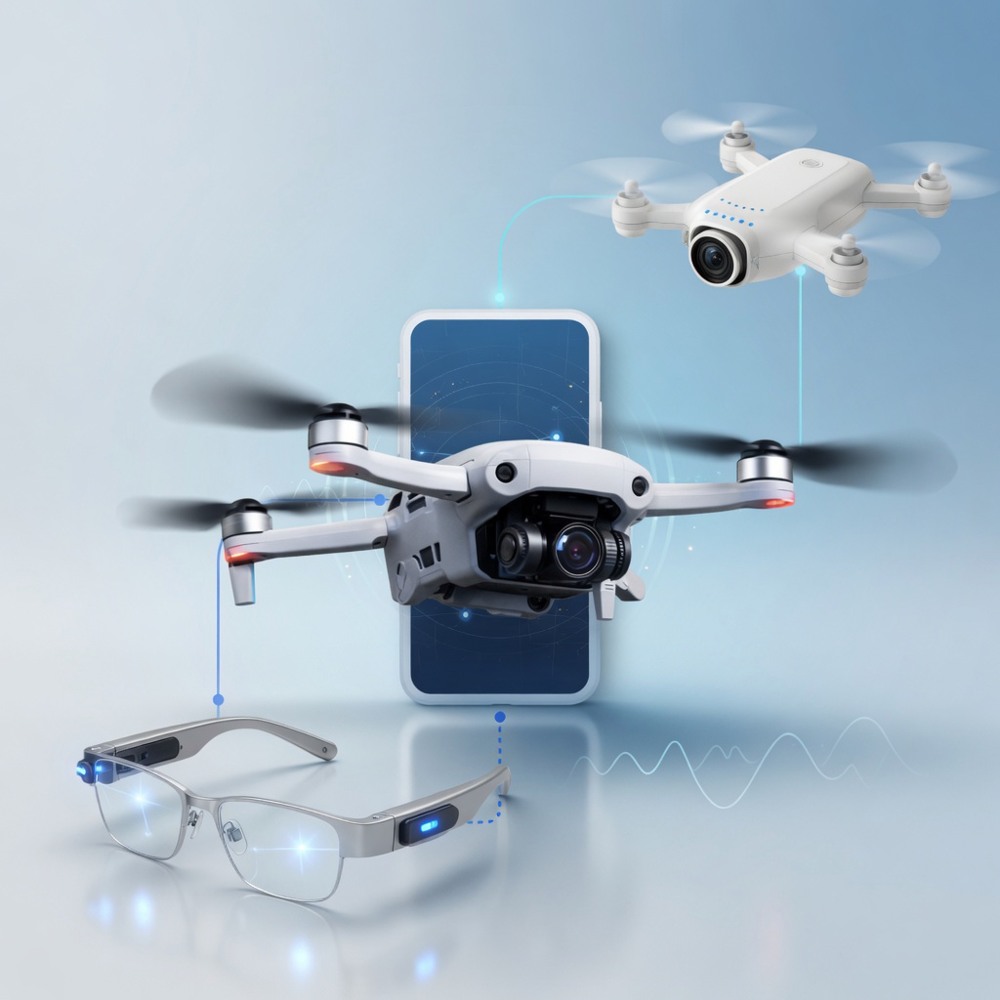
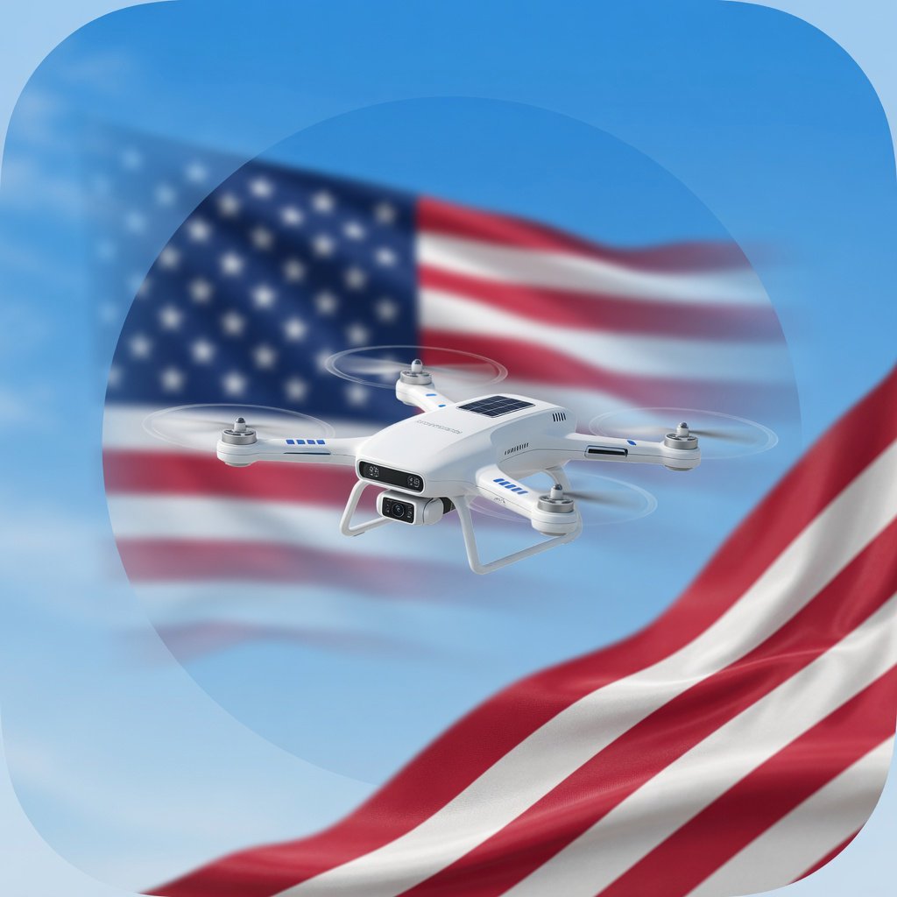
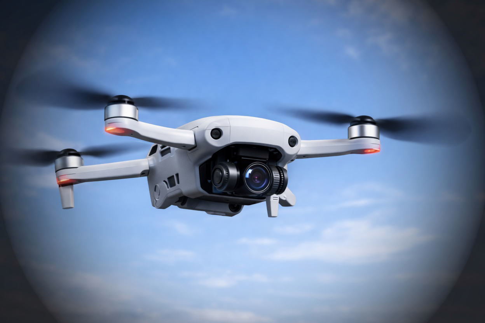
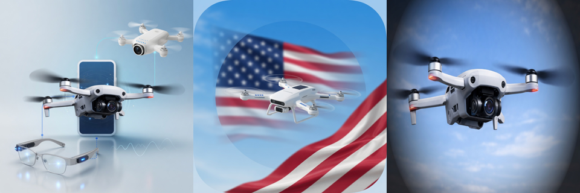

# Inspiration — why eyeWalker exists

**Research prototype · not a medical device · not a cane or guide dog replacement.**

## Human problem

Millions of people live with low vision or vision loss from **rare neuro-ophthalmic disease** and many other neurologic / ophthalmologic causes (for example NMOSD, MOGAD, LHON, OPA1, IIH, CVI, glaucoma, diabetic retinopathy, stroke-related field loss, and more). Mobility independence still depends first on **cane, guide dog, training, and trusted humans**. Software can only ever be **assistive research** — never a substitute for those foundations.

**eyeWalker** started from that lived context at **NeuroAgent AI**: build open tools so researchers, developers, and communities can experiment with **accessibility interfaces** that speak clearly, fail safely, and stay honest about what is simulated vs real.

## Product inspiration (multimodal *concept*)

Long-term research inspiration is **multimodal sensing for assistive access** — how phone, glasses-class wearables, and (where lawful and consented) elevated or aerial *research* views might one day inform **interface experiments**, not weaponized or covert systems.

The open **v1.1.9** build is intentionally narrower:

| Open build today | Concept art / future research |
|------------------|-------------------------------|
| Browser **PWA** with **simulated** research cues | Multimodal collage (drone + phone + glasses) as **inspiration only** |
| Consent-gated local REC / GPS trail | No live aerial pipeline shipped in this medical OSS tree |
| Honest labels · local-first demos | No claim of national-security product, ISR, or dual-use system |

### Concept gallery

Animated multimodal concept (drone + phone + glasses · flag motif · clean drone avatar):

Still frames:

| | |
|--|--|
| Multimodal (drone · phone · glasses) |  |
| Flag + drone motif (civic / open-research framing) |  |
| Clean drone avatar |  |
| Collage strip |  |

**What these images are:** synthetic / generative **concept art** for storytelling and README education.  
**What they are not:** screenshots of a deployed surveillance stack, a military product, a medical device UI, or a guarantee of on-device privacy.

## Design principles that followed from the inspiration

1. **Cane first** — software never replaces traditional mobility aids.  
2. **Honest simulation** — cues are labeled simulated unless a real detector is explicitly connected.  
3. **Consent for capture** — REC and precise GPS trail require an explicit checkbox; revoke stops capture.  
4. **Local-first preference** — demos should not need a cloud brain to open.  
5. **Open for noncommercial research** — PolyForm Noncommercial core; exact MIT allowlist for mobile/PWA files (see [DUAL_LICENSE.md](../DUAL_LICENSE.md)).  
6. **No fake security marketing** — optional NemoClaw docs are a policy *sketch*, not a certified product.

## Public vs private lanes

- **This public medical OSS repo** (`eyeWalker-v1.1`) is for assistive / accessibility **research** and the open PWA.  
- Separate **private** company workstreams (if any) are not claimed by this README and are not part of the `v1.1.9` ship tag.  
- We do **not** present eyeWalker as a national-security, ISR, or dual-use weapons product.

## Try the open interface

- PWA source: [pwa.html](pwa.html)  
- Deployed Pages route (verify revision): https://aeyemovment.github.io/eyeWalker-v1.1/pwa.html  
- Safety: [SAFETY.md](../SAFETY.md) · Privacy: [PRIVACY.md](../PRIVACY.md)

---

© 2026 NeuroAgent AI · eyeWalker research prototype — not a medical device.
